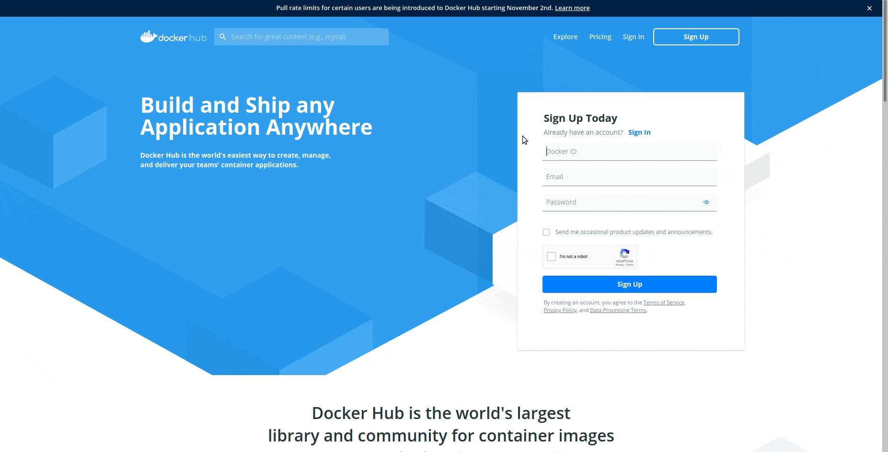
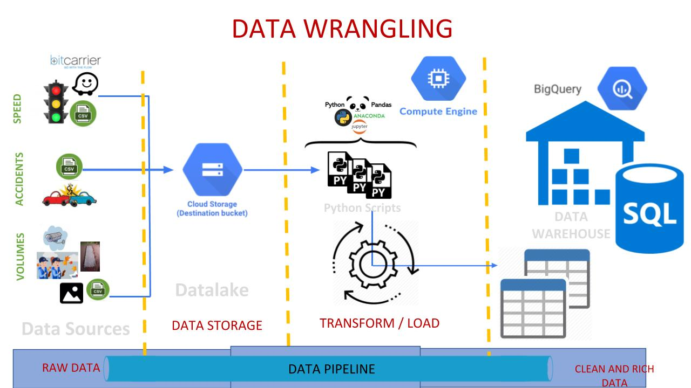

#

<p align="center"><a href="https://modin.readthedocs.io"></a></p>
<h1 align="center">Team 80 DS4A 2020 - Mobilidata</h1>

## Project Description

Lorem ipsum dolor sit amet, consectetur adipiscing elit. Duis rutrum molestie magna, finibus imperdiet lacus. Maecenas hendrerit turpis a dignissim pretium. Cras lectus eros, fermentum nec neque eu, blandit rhoncus eros. Morbi placerat metus elit, eu feugiat nisl vulputate id. Fusce sed vestibulum lacus, et viverra odio. Praesent in tempus magna. Aenean egestas lacus felis, eu feugiat sem eleifend eu. Proin velit nisl, efficitur eu finibus eget, aliquet ut sem. Sed ornare lorem ut nibh cursus vehicula. Sed accumsan erat sed placerat interdum. Etiam at eros ut ipsum aliquet gravida. Proin lacinia velit et mauris auctor, vitae posuere metus pellentesque. Aenean sed libero nulla. Mauris eu felis a massa molestie efficitur nec a arcu. Quisque sodales lorem in feugiat feugiat. Quisque ac tortor a nibh semper pharetra.

- Volumes of vehicles
- Speed
- Siniestralidad

## Front-end Description

Lorem ipsum dolor sit amet, consectetur adipiscing elit. Duis rutrum molestie magna, finibus imperdiet lacus. Maecenas hendrerit turpis a dignissim pretium. Cras lectus eros, fermentum nec neque eu, blandit rhoncus eros. Morbi placerat metus elit, eu feugiat nisl vulputate id. Fusce sed vestibulum lacus, et viverra odio. Praesent in tempus magna. Aenean egestas lacus felis, eu feugiat sem eleifend eu. Proin velit nisl, efficitur eu finibus eget, aliquet ut sem. Sed ornare lorem ut nibh cursus vehicula. Sed accumsan erat sed placerat interdum. Etiam at eros ut ipsum aliquet gravida. Proin lacinia velit et mauris auctor, vitae posuere metus pellentesque. Aenean sed libero nulla. Mauris eu felis a massa molestie efficitur nec a arcu. Quisque sodales lorem in feugiat feugiat. Quisque ac tortor a nibh semper pharetra.



## Data Wrangling

Lorem ipsum dolor sit amet, consectetur adipiscing elit. Duis rutrum molestie magna, finibus imperdiet lacus. Maecenas hendrerit turpis a dignissim pretium. Cras lectus eros, fermentum nec neque eu, blandit rhoncus eros. Morbi placerat metus elit, eu feugiat nisl vulputate id. Fusce sed vestibulum lacus, et viverra odio. Praesent in tempus magna. Aenean egestas lacus felis, eu feugiat sem eleifend eu. Proin velit nisl, efficitur eu finibus eget, aliquet ut sem. Sed ornare lorem ut nibh cursus vehicula. Sed accumsan erat sed placerat interdum. Etiam at eros ut ipsum aliquet gravida. Proin lacinia velit et mauris auctor, vitae posuere metus pellentesque. Aenean sed libero nulla. Mauris eu felis a massa molestie efficitur nec a arcu. Quisque sodales lorem in feugiat feugiat. Quisque ac tortor a nibh semper pharetra.



## Modeling

Lorem ipsum dolor sit amet, consectetur adipiscing elit. Duis rutrum molestie magna, finibus imperdiet lacus. Maecenas hendrerit turpis a dignissim pretium. Cras lectus eros, fermentum nec neque eu, blandit rhoncus eros. Morbi placerat metus elit, eu feugiat nisl vulputate id. Fusce sed vestibulum lacus, et viverra odio. Praesent in tempus magna. Aenean egestas lacus felis, eu feugiat sem eleifend eu. Proin velit nisl, efficitur eu finibus eget, aliquet ut sem. Sed ornare lorem ut nibh cursus vehicula. Sed accumsan erat sed placerat interdum. Etiam at eros ut ipsum aliquet gravida. Proin lacinia velit et mauris auctor, vitae posuere metus pellentesque. Aenean sed libero nulla. Mauris eu felis a massa molestie efficitur nec a arcu. Quisque sodales lorem in feugiat feugiat. Quisque ac tortor a nibh semper pharetra.

## Infrastructure diagram

Infrastructure is currently deployed on a GCP Compute Engine instance.


## How to run the app

To install the dependencies:

```bash
pip install requirements.txt
```

To run the application:

```bash
python app.py
```

## Collaborators of the project

[](https://sourcerer.io/fame/clmnt/huggingface/transformers/links/0)
[](https://sourcerer.io/fame/clmnt/huggingface/transformers/links/5)
[](https://www.linkedin.com/in/jsquirogacloudanalyst/)
[](https://sourcerer.io/fame/clmnt/huggingface/transformers/links/3)
[](https://sourcerer.io/fame/clmnt/huggingface/transformers/links/4)
[](https://sourcerer.io/fame/clmnt/huggingface/transformers/links/5)
[](https://sourcerer.io/fame/clmnt/huggingface/transformers/links/1)

- [Mónica Otálora](http://github.com)
- [Vicente Castro](http://github.com)
- [Johan Quiroga](http://github.com)
- [Sheijer Silva](http://github.com)
- [Hector Florez](http://github.com)
- [Marcela Garzon](http://github.com)
- [Nicolás Roldán](http://github.com)
