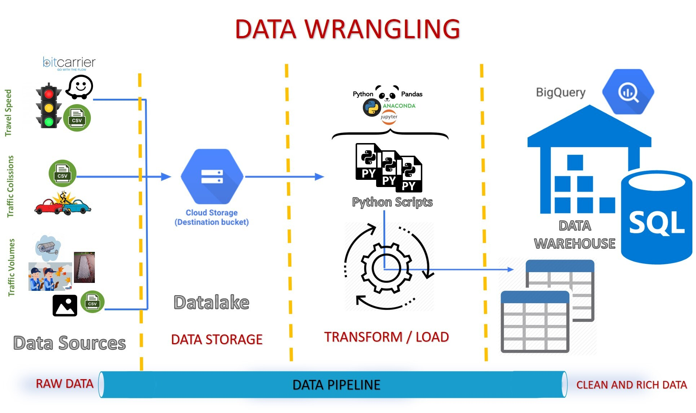
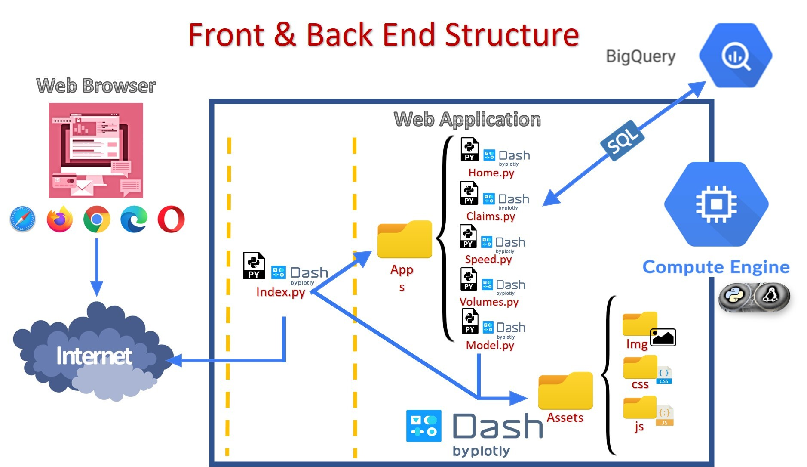

#

<p align="center"><a href="https://modin.readthedocs.io"></a></p>
<h1 align="center">Mobilidata Code Repository</h1>

## Project Description

Currently, Secretaria Distrital de Movilidad (SDM) has independent developments aimed at providing specific and limited-use solutions and there are different methods of capturing the same data, which means that these do not necessarily coincide with each other. We are interested in providing to the SDM a good integrated understanding about principal variables to monitor mobility in cities: traffic crashes, travel speed and vehicular volumes.

Based on proper information that must be able to explain the dynamics of the city, people from SDM who make decisions might assess the best ways to improve mobility. It means that they can visualize in the best possible way the most important issues in the city opportunely.

The expectations of SDM are focused on analyzing, prioritizing and monitoring KPIs obtained from existing sources and having an off-line dashboard, which must allow users to periodically upload new information. Nevertheless, it would be great if it could be implemented using on-line information.

It is necessary to have tools that allow comprehensive and versatile decision making. So, colombian government requests to carry out the follow-up, monitoring and control of these.

In order to face the problem, we develop an integrated data science approach that allows users to:

1. Statistically explore the data from various sources as well as identifying relevant characteristics in terms of speed per corridor and road sections, number of vehicles (traffic volume), and road accidents in different parts of the city.
2. Analyze differences between periods with and without Pico y Placa implemented.
3. Predict traffic crashes based on a machine learning model.

## Dataset Description

There are mainly 3 datasets:

- Speed Dataset
- Volumes Dataset
- Traffic incidents

## Front-end Description

Mobilidata has an interactive app build with Dash-Plotly and deployed on an Compute Engine instance on Google Cloud Platform (GCP). Mobilidata app consists of four main parts, that corresponds to each dataset and another to interact with a Forecasting model based on __XGBoost__.


## Data Wrangling

For the data wrangling process we design an automated data pipeline which takes advantage of some services of the Google Cloud Platform. These scripts are stored in a Compute Engine instance and are executed every time that the customer adds a new source to the data lake. This process ends with the cleaned and enriched data uploaded to Big query Datasets and tables.



## Modeling

Traffic incidents are an issue that not only affects the authorities but the population in general and taking into account that the number of accidents in the city is higher in some locations and for some road actors; we decided to make a model that predicts the number of traffic incidents per day based on the history period of the number of incidents found between the years 2015-2019.

We carry out the model for three different scenarios:

- Forecast model for Bogotá.
- Model for the 3 boroughs that have presented the highest number of claims over the years (Kennedy, Usaquén and Engativá).
- Model for the road actor most likely to be injured or killed in an traffic incident, which in this case is motorcyclists.

In order to make a predictive model we used two methods, one of them was the __SARIMAX__ model (autoregressive integrated moving average with explanatory variables), which is widely used in mobility issues, since exogenous variables can be implemented to make forecasts. Finally we implemented the XGboost algorithm (Extra Gradient boosting), by which we obtained better results. This model has advantages such as working on large databases with multiple variables -both categorical and numerical-, and admits missing values.

The final model was hosted on __Google App Engine__, serializing the trained model with joblib, and creating a REST API with __Flask microframework__ for consuming it from the front-end. The API has a __POST__ method, __predict/generalModel__. The request is composed of the range of dates to predict and the response for the predicted mean and vector of timestamps generated for plotting the time signal.

__Endpoint:__ https://scenic-kiln-292815.ue.r.appspot.com/predict/generalModel

__Request:__

```json
{
    "start_date": "2019-01-30",
    "end_date": "2019-05-30"
}
```

__Response:__

```json
{
    "prediction": {
        "mean_prediction": "[104.63495, 108.06348, 62.53693, 102.04226, 104.68569, 114.58703, 111.17363, 94.755264, 89.09295, 99.039604, 100.42436, 92.091484, 88.23981, 108.79684, 106.26583, 106.05597, 112.43898, 107.556076, 73.78728, 86.95864, 97.631714, 105.648506, 111.00951, 116.62547, 107.32968, 75.06454, 98.69066, 109.74157, 106.93097, 107.48731, 59.456367, 98.96169, 101.60513, 111.50646, 108.09306, 97.795494, 92.13318, 102.90746, 104.29222, 95.95934, 92.107666, 117.53312, 115.00211, 114.79225, 119.720764, 114.83786, 81.06906, 95.69492, 106.368, 108.49966, 113.86066, 118.022125, 103.00057, 60.481293, 88.40683, 99.45773, 95.076996, 95.63334, 103.60082, 89.90771, 58.06373, 55.59372, 93.00696, 106.34391, 97.081856, 100.20645, 97.589745, 83.179535, 87.42129, 102.304565, 100.6401, 96.41962, 109.3228, 103.747475, 68.67374, 94.91139, 106.202034, 97.924614, 80.14255, 81.60484, 85.05248, 60.678413, 95.8788, 101.9715, 107.053665, 108.89842, 117.52933, 109.76687, 73.00832, 111.42301, 109.41582, 63.31998, 101.677704, 114.04079, 107.943535, 98.35917, 111.85732, 99.93922, 99.26608, 102.161194, 105.722824, 100.54062, 88.968735, 101.37199, 111.89642, 109.36542, 112.31626, 114.1025, 100.9419, 67.15031, 98.21631, 114.311615, 108.30992, 107.4963, 111.9197, 106.28421, 72.67095, 109.20847, 112.50715, 112.44057, 108.8746]"
    },
    "success": true
}
```

## Infrastructure diagram

The web application is hosted in a __Compute Engine instance__, this instance runs in the same network and region where the __Big Query__ datasets are located which makes the response time faster. With every new user option selection event on the front end a SQL query is sent to the Data warehouse and it brings the queried data response.

The application was implement with a multipage approach in which an index application made calls for another sub branches to show it in the front like we see in the figure, in addition all this sub apps consume resources from the assets folder, for the web application implementation and for every one of the dashboards we used Dash, HTML, CSS, and some JavaScript scripts and in addition we implement Bootstrap.



## How to run the app

To install the dependencies:

```bash
pip install requirements.txt
```

To run the application:

```bash
python index.py
```

## Collaborators of the project

[](https://www.linkedin.com/in/m%C3%B3nica-ot%C3%A1lora-montenegro-603bb9108/)
[](https://www.linkedin.com/in/vicentecastro/)
[](https://www.linkedin.com/in/jsquirogacloudanalyst/)
[](https://www.linkedin.com/in/sheijers/)
[](https://www.linkedin.com/in/florezfernandez/)
[](https://sourcerer.io/fame/clmnt/huggingface/transformers/links/5)
[](https://www.linkedin.com/in/nicolas-roldan-fajardo/)

- Mónica Otálora
- Vicente Castro
- Johan Quiroga
- Sheijer Silva
- Hector Florez
- Marcela Garzon
- Nicolás Roldán
